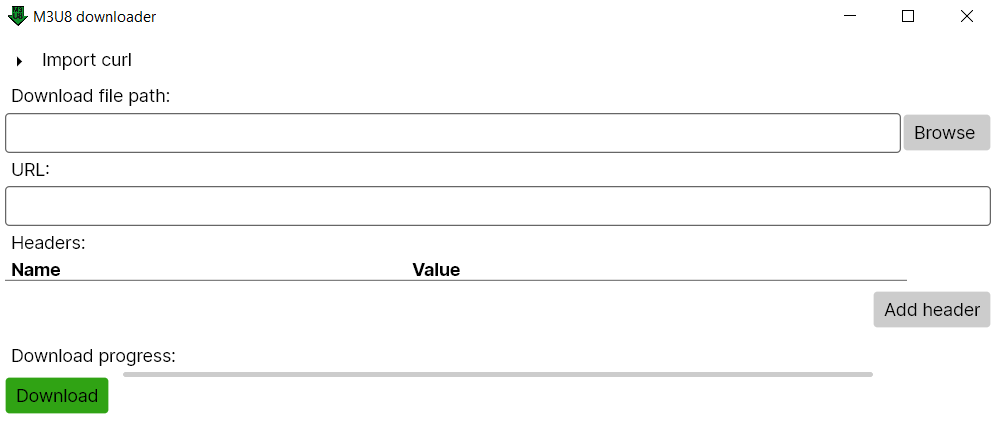

# M3U8 downloader

## Requirements
.NET 5.0 runtime - download here: https://dotnet.microsoft.com/download/dotnet/5.0/runtime

## General usage
- set path where you want to download the file
- set URL to download from
- click "Add header" if specific headers are needed for your request to succeed
- click "Download" button

## CURL import
- expand "Import curl", paste CURL query to the text field, click "Import" button
- URL and headers will be filled in based on your request

Icon made with https://www.figma.com/

